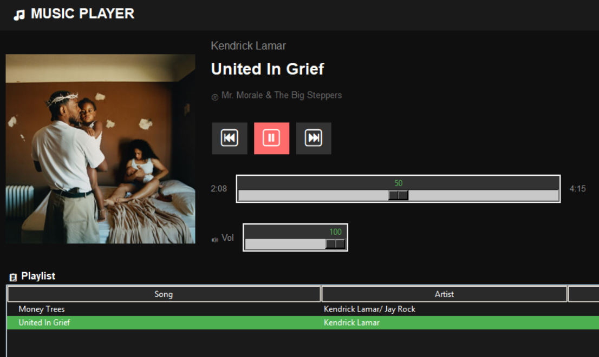

# Music Player


by [@Bruhniko](https://github.com/Bruhniko) and [@paulosantyp](https://github.com/paulosantyp)

**Music Player** is a desktop application built in [Python](https://github.com/topics/python)
 to play local music files
 


## Objective
This university-level beginner project is designed to deliver a functional music player that supports playing audio files in formats such as .mp3, .wav, and .flac. Additionally, it provides features to display song metadata for the user.

## Description
This player uses [Python](https://github.com/topics/python), [Mutagen](https://github.com/quodlibet/mutagen) to read audio formats, [Tkinter](https://docs.python.org/3/library/tkinter.html) for the GUI, and [Pygame](https://github.com/pygame/pygame) for audio playback.

## Releases
<details>
<summary>Alpha v0.1.o FIRST RELEASE!</summary>
  
- The application has been successfully uploaded to GitHub for collaborative use and improvement.
  
- Loading entire folders containing supported audio formats.
  
- Extraction and display of metadata like title, artist, album, format, duration, bitrate, and album cover.
  
- Playback controls.
  
- Progress bar with slider.
  
- Volume control slider.
  
- Sidebar to search songs and filter by categories such as artist, genre, folder, and playlist (Not working rn).
  
- Detailed metadata panel with scroll to view all available information.
  
</details>

<summary>Alpha v0.1.2 </summary>
  
- Bugs fixed

- Filter categories deleted

- Search Bar fixed

- Icon added

</details>

## Requirements
<details> <summary>Windows/ MacOS</summary>
  
  - Python 3 or higher
  
  - Pygame library
    
  - Mutagen
    
  - PIL (Pillow)
</details>

## Installation

Install all required dependencies via pip:
```py
pip install pygame mutagen pillow
```
Run the main script to open the app.
```py
python Music_PLayer.py
```
 Use the "Open Folder" button to load your music and start playback!.
